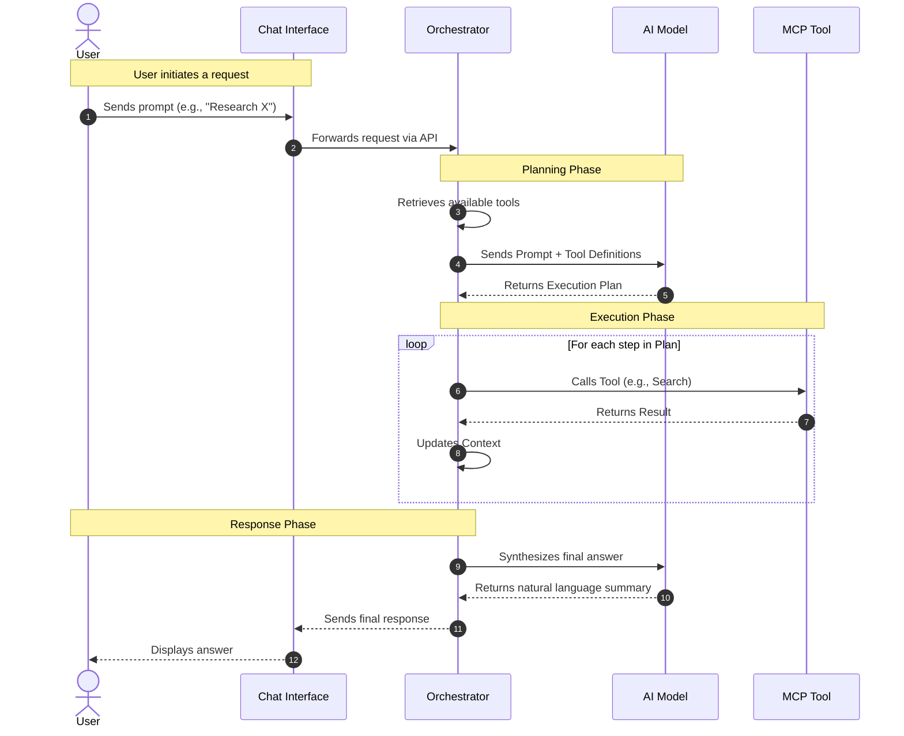
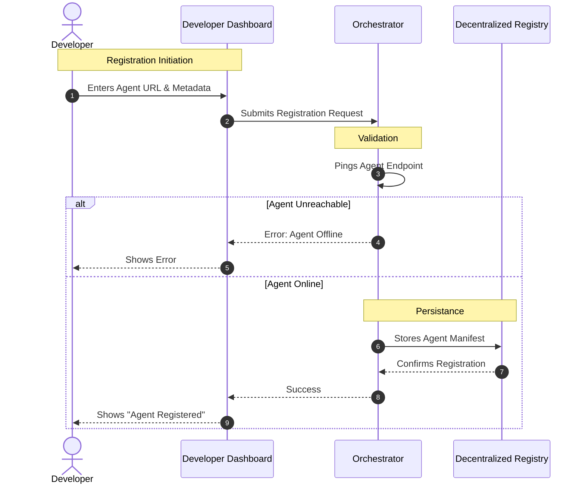
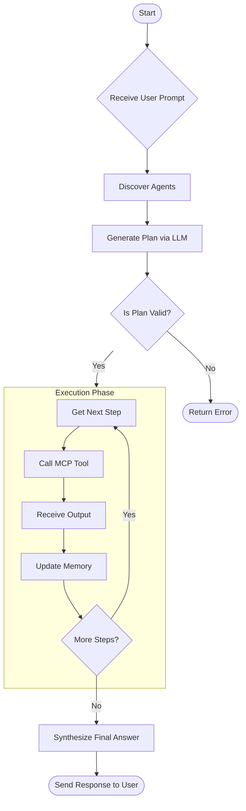

# Nexus Workflow Documentation

**Version:** 1.0.0
**Last Updated:** November 28, 2025

This document outlines the core workflows of the Nexus platform using visual diagrams. It covers how users interact with the system, how developers register agents, and the internal logic of the orchestrator.

---

## 1. User Interaction Workflow

This flow describes the lifecycle of a user's chat request, from the initial prompt to the final response.



---

## 2. Agent Registration Workflow

This flow illustrates how a developer adds a new agent to the decentralized registry.



---

## 3. Orchestration Logic

This flowchart details the internal decision-making process of the Orchestrator.



---

## 4. Key Concepts

### Planning
The system does not use hard-coded logic. Instead, it uses a Large Language Model (LLM) to dynamically generate a plan based on the user's intent and the tools currently available in the registry.

### Execution
Tools are executed sequentially. The output of one tool (e.g., a search result) is fed back into the context, allowing subsequent tools (e.g., a summarizer) to use that information.

### Decentralization
The registry is hosted on a blockchain network, ensuring that no single entity can censor or remove agents. This creates a permissionless ecosystem where any developer can contribute.

---

## 5. Restoring Agents

If you restart the local Internet Computer replica (`dfx start --clean`) or move to a new device, the agent registry will be empty. To restore the default agents:

1.  **Ensure all services are running:**
    *   Orchestrator (`uvicorn orchestrator.main:app ...`)
    *   Agent services (Web Search, Email, etc.)

2.  **Run the registration script:**
    ```bash
    python register_demo_agents.py
    ```

This script will:
*   Register the Web Search, Summarise, Email, and RAG agents.
*   Register the Orchestrator itself.
*   Use `localhost` endpoints for local development.
