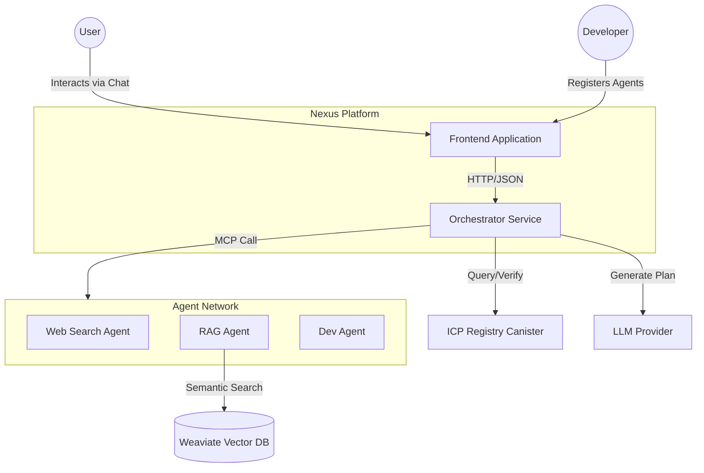
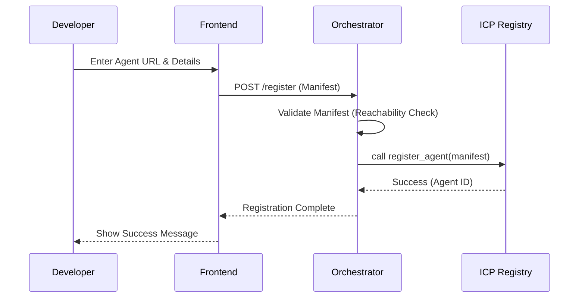
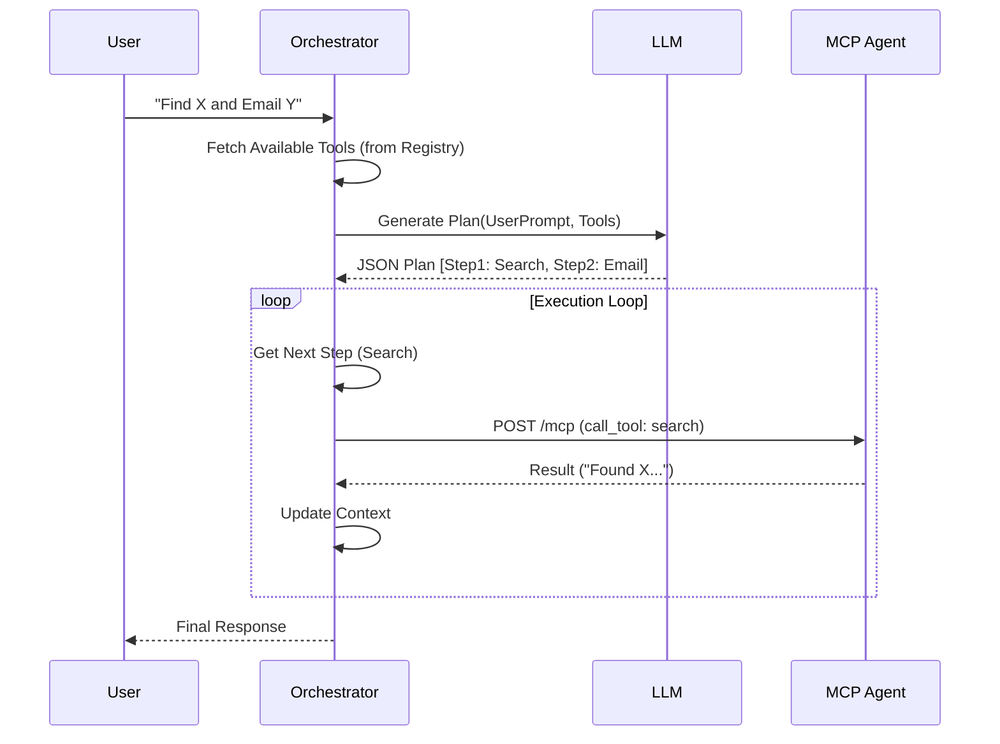

# Nexus Architecture Reference

**Version:** 1.0.0
**Last Updated:** November 28, 2025

This document provides a comprehensive technical overview of the Nexus (MCP Agent Hub) architecture. It covers the system design, data models, API specifications, and security protocols.

---

## 1. System Overview

Nexus is a decentralized orchestration platform that connects users with a network of autonomous AI agents. It leverages the **Model Context Protocol (MCP)** for standardized tool execution and the **Internet Computer (ICP)** for a tamper-proof, decentralized agent registry.

### 1.1 Core Design Principles
*   **Decentralization:** No single entity controls the directory of available agents.
*   **Interoperability:** Any agent implementing MCP can join the network.
*   **Verifiability:** Agent identities and responses can be cryptographically verified.
*   **Composability:** Agents can be chained together to solve complex problems.

---

## 2. Architecture Diagrams

### 2.1 System Context (C4 Level 1)



### 2.2 Sequence Diagram: Agent Registration



### 2.3 Sequence Diagram: Planning & Execution



---

## 3. Data Models

### 3.1 Agent Manifest
The blueprint that defines an agent's identity and capabilities.

```json
{
  "id": "agent-123-abc",
  "name": "Web Search Agent",
  "description": "Searches the internet for real-time information.",
  "endpoint_url": "http://localhost:7002/mcp",
  "public_key": "ed25519-pub-key-hex...",
  "tools": [
    {
      "name": "search_web",
      "description": "Execute a search query",
      "input_schema": {
        "type": "object",
        "properties": {
          "query": { "type": "string" }
        }
      }
    }
  ]
}
```

### 3.2 Execution Plan
The step-by-step instructions generated by the LLM.

```json
{
  "steps": [
    {
      "id": "step-1",
      "tool_name": "search_web",
      "agent_id": "agent-123-abc",
      "arguments": {
        "query": "current stock price AAPL"
      },
      "rationale": "I need to find the current price first."
    }
  ]
}
```

### 3.3 MCP Message (JSON-RPC)
The standard format for communicating with agents.

**Request:**
```json
{
  "jsonrpc": "2.0",
  "method": "tools/call",
  "params": {
    "name": "search_web",
    "arguments": { "query": "hello world" }
  },
  "id": 1
}
```

**Response:**
```json
{
  "jsonrpc": "2.0",
  "result": {
    "content": [
      { "type": "text", "text": "Search results for..." }
    ]
  },
  "id": 1
}
```

---

## 4. API Reference

### 4.1 Orchestrator API (`http://localhost:8000`)

| Endpoint | Method | Description |
|----------|--------|-------------|
| `/plan` | POST | Generates an execution plan from a user prompt. |
| `/execute` | POST | Executes a specific plan or a single step. |
| `/register` | POST | Registers a new agent in the system. |
| `/agents` | GET | Lists all available agents (cached from Registry). |

### 4.2 Agent API Standard

All agents must expose a POST endpoint (typically `/mcp`) that accepts JSON-RPC 2.0 messages.

*   `tools/list`: Returns the list of tools the agent supports.
*   `tools/call`: Executes a specific tool.

---

## 5. Security & Trust

### 5.1 Registry Verification
The **Internet Computer** acts as the root of trust.
1.  When an agent is registered, its `public_key` is stored in the canister.
2.  This record is immutable (except by the owner) and tamper-proof.

### 5.2 Response Signing (Future)
To prevent man-in-the-middle attacks where a malicious proxy alters an agent's response:
1.  The Agent signs its JSON-RPC response with its private key.
2.  The Orchestrator fetches the `public_key` from the Registry.
3.  The Orchestrator verifies the signature before processing the result.

### 5.3 Sandboxing
The Orchestrator treats all agents as untrusted external entities. It does not execute arbitrary code sent by agents; it only consumes structured data (JSON).

---

## 6. Infrastructure

*   **Orchestrator:** Python / FastAPI / Uvicorn
*   **Database:** Weaviate (Vector), ChromaDB (Local Vector)
*   **Frontend:** React / Vite / Tailwind
*   **Registry:** Motoko Canister (ICP)

---
*End of Architecture Reference*
